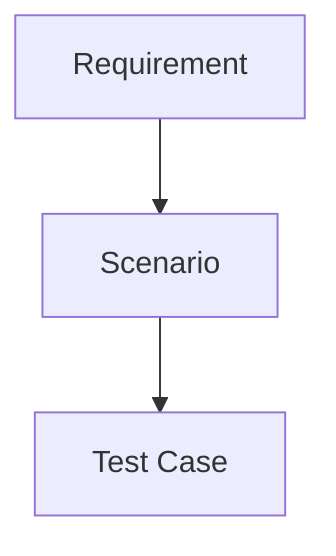

# AI-QA-OS Documentation Standard

Version: 1.1.0

Document Type: Documentation Governance Standard

Document Status: Active

Purpose:

Define the rules every file inside `docs/` must follow so that Architecture, Phases, Implementation, Prompts, Verification, Workflow, API, Guides, and the reference folders below stay consistent no matter which Step or Phase authors them.

This Standard governs `docs/`. It does not change or replace the existing `00-Foundation/` blueprint documents, which keep their own established naming (`00_FOUNDATION_BLUEPRINT.md` style, UPPER_SNAKE_CASE) because they were written before this Standard and are foundational, one-time architecture artifacts. This Standard file and `README.md` live at the repository root (`AI-QA-OS-Docs/`) as the entry point to both `00-Foundation/` and `docs/`.

---

# 1. File Naming Convention

Every file inside a per-step folder (`docs/phases/`, `docs/implementation/`, `docs/prompts/`, `docs/verification/`) must be prefixed with a two-digit number followed by a hyphen.

Format:

```
NN-Descriptive-Name.md
```

Example:

```
01-Requirement-Management.md
02-Semantic-Parser.md
03-Brain-Analysis.md
04-RAG-Integration.md
05-Test-Case-Generator.md
```

Reason:

A plain file listing then sorts automatically in build order — no manual re-ordering, no ambiguity about what comes next.

Rules:

- Numbers are two digits (`01`, not `1`) so ordering survives past 9.
- The name after the number uses PascalCase-with-hyphens (`Test-Case-Generator`, not `test_case_generator` or `testCaseGenerator`).
- The same number is reused across parallel folders for the same unit of work — Step 5's implementation doc, prompt doc, and verification doc are all `05-*.md` in their respective folders.
- Folders that hold a small fixed set of framework-level or reference files (`workflow/`, `templates/`, `guides/`, `api/`, `knowledge/`, `examples/`, `integrations/`, `assets/`) are not required to number files — name them descriptively instead (e.g. `Agent-Workflow.md`, `Jira-Integration.md`).
- `roadmap/` uses `00-` for the master roadmap file specifically, so it always sorts first in that folder.

## 1a. Folder-Specific Naming Patterns

A few folders don't fit the Step-numbered pattern and use their own convention instead:

| Folder | Pattern | Example |
|---|---|---|
| `docs/user-stories/` | `US-NNN-Descriptive-Name.md` | `US-001-User-Login.md` |
| `docs/decisions/` | `NNN-Descriptive-Title.md` (ADR style) | `001-Use-Claude-As-Primary-Model.md` |
| `docs/release-notes/` | `vX.Y.Z.md` | `v1.0.0.md` |
| `docs/changelog/` | `Component-Name.md` (one file per platform component, mirroring `01-Core/` module names) | `qa-brain.md`, `workflow-engine.md` |
| `docs/testing/` | Descriptive, no number (small fixed set) | `Test-Strategy.md`, `Coverage-Report.md` |

---

# 2. Folder Standards

Each folder under `docs/` covers exactly one concern:

| Folder | Concern |
|---|---|
| `architecture/` | System/module architecture specific to a step or subsystem |
| `phases/` | The 18 high-level build Phases |
| `implementation/` | The 12 functional development Steps |
| `prompts/` | Copy-paste-ready Claude Code prompts, one per Step |
| `verification/` | Post-implementation walkthroughs and pass/fail evidence, one per Step |
| `workflow/` | Fixed, one-time docs describing how the platform executes, learns, and coordinates agents |
| `roadmap/` | Fixed, one-time docs tracking overall project direction and release history |
| `api/` | API reference documentation as endpoints are built |
| `guides/` | User-facing and developer-facing how-to guides |
| `templates/` | Reusable Markdown templates copied to start any new step/phase/prompt/verification doc |
| `user-stories/` | Source user stories and acceptance criteria feeding the Requirement Agent |
| `knowledge/` | Curated reference knowledge and learnings behind documentation decisions |
| `examples/` | Worked examples — end-to-end sample walkthroughs |
| `integrations/` | How-to docs for external system integrations (Jira, GitHub, MCP servers, CI/CD) |
| `release-notes/` | What shipped in each released version, user-facing |
| `changelog/` | Per-component technical changelogs |
| `testing/` | Test strategy and coverage for the platform itself (distinct from `verification/`, which is per-Step) |
| `decisions/` | Architecture Decision Records (ADRs) |
| `assets/` | Images, diagrams, and other binary assets referenced from docs |

Every folder that will receive numbered or reference content over time carries a `README.md` explaining its purpose and current status — see the per-folder README files already in place.

---

# 3. Markdown Structure Standards

Every document should:

- Start with a single `# Title` line, followed by `Version:`, `Document Type:`, and `Document Status:` metadata lines, matching the style already used in `00-Foundation/`.
- Use `---` as a horizontal rule to separate major sections.
- Use `#` for the document title, `##` within a section only when a section needs sub-breakdown — avoid going deeper than three heading levels.
- End with a `Document Completion Status` section stating `Status: Draft | In Progress | Completed` and the date it reached that status.

---

# 4. Diagram Standard (Mermaid)

When a diagram is needed, prefer a fenced Mermaid block over ASCII art so it renders on GitHub:



Use ASCII arrows (`↓`, `-->`) only for very short two/three-node flows inline in prose, matching the existing Foundation doc style. Anything with more than three nodes or any branching gets a Mermaid block. Any diagram that can't be expressed in Mermaid (screenshots, exported images) goes in `docs/assets/` and is referenced with a relative Markdown image link.

---

# 5. Code Block Standards

- Always tag the language: ```` ```java ````, ```` ```yaml ````, ```` ```json ````, ```` ```bash ````.
- Never include real credentials, tokens, or connection strings in an example — use placeholders (`<API_KEY>`, `${DB_PASSWORD}`).
- Keep examples runnable/copy-pasteable where practical rather than abbreviated pseudocode.

---

# 6. Prompt-Writing Standard

Every file under `docs/prompts/` must follow the four-part structure already defined as the "AI Prompt Execution Rules" in `00_FOUNDATION_BLUEPRINT.md`:

- **Context** — what exists already and needs to be built on
- **Objective** — what needs to be created
- **Constraints** — limitations, architecture rules, files that must not change
- **Expected Output** — exact deliverable Claude Code should produce, and how it will be verified

Use `docs/templates/Claude-Prompt-Template.md` as the starting point for every new prompt doc.

---

# 7. Verification Standard

Every file under `docs/verification/` must capture:

- Which Implementation Step and Prompt it verifies (cross-reference by number)
- Steps actually performed
- Expected result vs. actual result
- Pass / Fail / Partial verdict
- Evidence (command output, screenshot reference, log excerpt)
- Follow-up items if Partial or Fail

Use `docs/templates/Verification-Template.md` as the starting point.

`docs/testing/` is the platform-wide counterpart to this — overall test strategy and coverage, not tied to a single Step.

---

# 8. Versioning Rules

- Every document carries `Version: X.Y.Z` in its header.
- Increment the patch version for wording/typo fixes, minor for added sections, major for a structural rewrite.
- `docs/roadmap/Version-History.md` is the single changelog of record for the **documentation set** itself.
- `docs/changelog/` tracks per-**component** technical changes as the platform is built.
- `docs/release-notes/` tracks user-facing summaries per shipped **version**.
- None of these three replace the platform's own software version tracking, which is separate per `00_FOUNDATION_BLUEPRINT.md` Rule 13 — Version Management.

---

# 9. Changelog Format

Entries in `docs/roadmap/Version-History.md` and `docs/changelog/*.md` follow:

```
## [Version] - YYYY-MM-DD
### Added
- ...
### Changed
- ...
### Fixed
- ...
```

---

# Document Completion Status

Status: Completed

Version: 1.1.0
