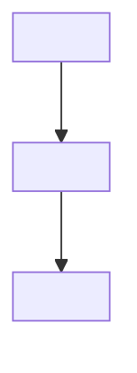

# <Component Name> - Architecture

Version: 1.0.0

Document Type: Component Architecture

Document Status: Draft

---

# 1. Purpose

<What this component is responsible for, in one or two sentences.>

---

# 2. Depends On

- <Component>

# 3. Used By

- <Component>

---

# 4. Diagram

---

# 5. Input / Output Contract

Input:

- <field/type>

Output:

- <field/type>

---

# 6. Integration Points

- <External system, MCP server, or other engine this component talks to>

---

# 7. Configuration

- <Config keys this component reads, and where they live under `11-Configuration/`>

---

# Document Completion Status

Status: Draft

Version: 1.0.0
