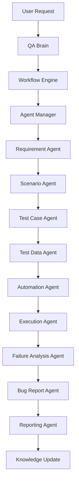

# AI-QA-OS Workflow

Version: 1.0.0

Document Type: Workflow Reference

Document Status: Completed

Purpose:

Summarize the complete end-to-end platform workflow at a glance. Full detail lives in `00-Foundation/00_FOUNDATION_BLUEPRINT.md` ("Runtime Execution Flow") and `00-Foundation/01_PROJECT_VISION.md` ("Complete AI-QA-OS Lifecycle") — this document is the quick-reference index, not a replacement.

---

# End-to-End Flow

---

# Where Each Stage Is Defined

| Stage | Reference |
|---|---|
| Decision-making | `00_FOUNDATION_BLUEPRINT.md` — QA Brain |
| Workflow control | `00_FOUNDATION_BLUEPRINT.md` — Workflow Engine |
| Agent responsibilities | `00_FOUNDATION_BLUEPRINT.md` — Agent Ecosystem Blueprint |
| Communication rules | [`Agent-Workflow.md`](./Agent-Workflow.md) |
| Execution details | [`Execution-Workflow.md`](./Execution-Workflow.md) |
| Learning loop | [`Learning-Workflow.md`](./Learning-Workflow.md) |

---

# Document Completion Status

Status: Completed

Version: 1.0.0
