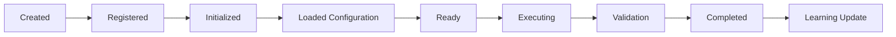

# Agent Workflow

Version: 1.0.0

Document Type: Workflow Reference

Document Status: Completed

Purpose:

Capture the non-negotiable agent lifecycle and communication rules from `00-Foundation/00_FOUNDATION_BLUEPRINT.md` (Agent Ecosystem Blueprint) in one place, so every implementation step can be checked against them quickly.

---

# Agent Lifecycle



---

# Communication Rule (must never be violated)

Agents never call each other directly.

Incorrect:

```
Requirement Agent --> Automation Agent
```

Correct:

```
Requirement Agent --> Agent Manager --> Workflow Engine --> Automation Agent
```

Every implementation step's verification (see `verification/`) must confirm this rule was followed before the step is marked Pass.

---

# Agent Contract Checklist

Every agent must define, per `01_PROJECT_VISION.md`:

- [ ] Input Contract
- [ ] Output Contract
- [ ] Configuration
- [ ] Prompt Templates
- [ ] Error Strategy
- [ ] Retry Strategy
- [ ] Logging Strategy

---

# Document Completion Status

Status: Completed

Version: 1.0.0
