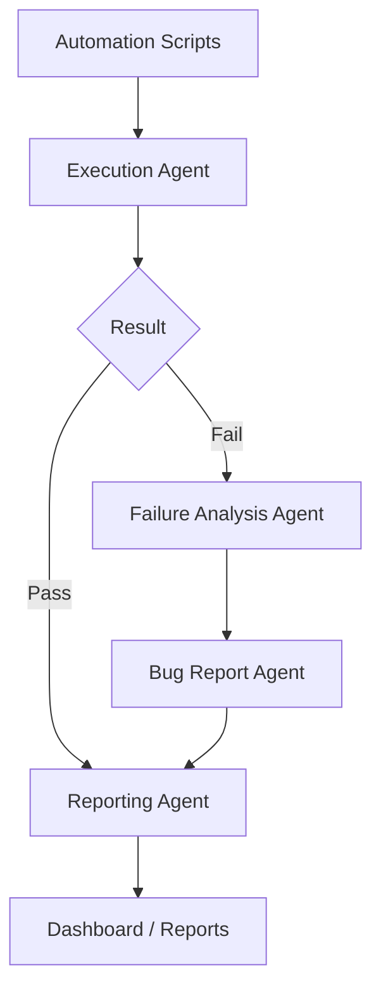

# Execution Workflow

Version: 1.0.0

Document Type: Workflow Reference

Document Status: Completed

Purpose:

Describe what happens once automation code exists and needs to run, through to a reported result. Agent responsibilities are defined in `00-Foundation/00_FOUNDATION_BLUEPRINT.md` (Layer 3 / Layer 5); this document tracks the sequencing only.

---

# Flow

---

# Execution Agent Responsibilities

- Run generated automation (Selenium, Playwright, REST Assured, Appium, DB drivers)
- Capture logs, screenshots, execution status
- Hand off failures to the Failure Analysis Agent, successes straight to Reporting

# Failure Analysis Agent Responsibilities

- Analyze error logs, screenshots, stack trace
- Classify failure category (locator issue, data issue, environment issue, genuine defect)
- Emit root cause + recommended fix

# Bug Report Agent Responsibilities

- Turn a confirmed defect into a structured bug report (steps, expected/actual, evidence)
- Hand off to the configured issue tracker via the Jira MCP (see `00-Foundation/00_FOUNDATION_BLUEPRINT.md` — MCP Integration Blueprint)

---

# Retry & Self-Healing

Retry and self-healing behavior (Phase 5 of the Foundation Blueprint) is layered on top of this flow once the Self-Healing Agent exists — this workflow doc will be updated with that detail when that step is implemented.

---

# Document Completion Status

Status: Completed

Version: 1.0.0
