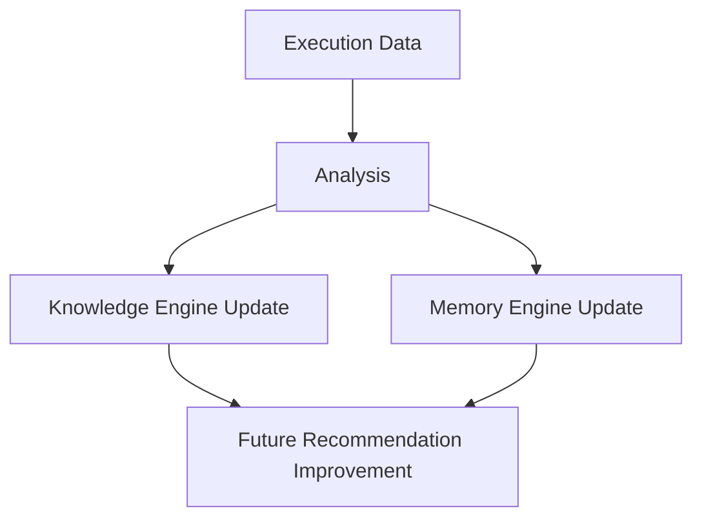

# Learning Workflow

Version: 1.0.0

Document Type: Workflow Reference

Document Status: Completed

Purpose:

Describe how execution results feed back into the platform's Knowledge and Memory layers so future runs improve. Component responsibilities are defined in `00-Foundation/00_FOUNDATION_BLUEPRINT.md` (Layer 4 — Knowledge Intelligence Layer).

---

# Flow

---

# Learning Sources

- Successful test cases
- Failed executions
- Bug patterns
- User corrections to AI-generated output
- Automation improvements discovered during execution

# What Gets Updated

| Engine | Stores |
|---|---|
| Knowledge Engine | QA standards, automation patterns, business rules, defect patterns, historical solutions |
| Memory Engine | Conversation memory, execution history, agent-level short/long-term memory |

---

# Confidence-Based Escalation

Per `00-Foundation/01_PROJECT_VISION.md` (AI Confidence Score): outputs below 70% confidence route to human review rather than being learned from automatically. Only validated outputs update the Knowledge Engine.

---

# Document Completion Status

Status: Completed

Version: 1.0.0
